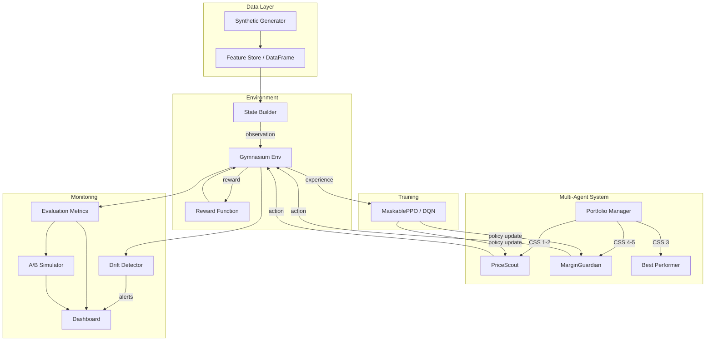

# RL Dynamic Pricing Agent

A production-credible reinforcement learning prototype for dynamic pricing in foodservice distribution. Features multi-agent orchestration, configurable synthetic data, and a Streamlit dashboard.

## Problem Framing: MDP Formulation

Dynamic pricing is modeled as a **Markov Decision Process (MDP)**:

| Component | Definition |
|-----------|-----------|
| **State** | 17-dimensional normalized vector: CSS score, performance percentile, potential tier, margin rate, margin dollars, weekly cases, weekly sales, deliveries/week, elasticity estimate, 4-period price action history, periods since last change, SYW flag, perks flag, churn probability |
| **Action** | Discrete(7): Hold, +2%, +5%, -2%, -5%, -10%, -15% price adjustments |
| **Reward** | Three tiers: MarginMaximizer (delta margin$), CLVOptimizer (CSS-weighted multi-term with churn/volatility penalties), PortfolioOptimizer (CLV + migration bonus) |
| **Transition** | Market simulator with elasticity-based volume response, stickiness dampening (8+ stable periods), SYW churn discount (18%), and quarterly seasonality |
| **Episode** | 52 weekly steps with early termination on churn |

### Why RL Over Supervised Learning?

1. **Sequential decision-making**: Pricing decisions have delayed, compounding effects on volume, churn, and margin that span multiple periods
2. **Exploration-exploitation**: RL naturally balances exploring new pricing strategies against exploiting known-good actions
3. **Reward shaping**: Custom reward functions encode complex business objectives (margin vs. retention vs. portfolio health) that supervised labels cannot capture
4. **Action masking**: Constrain the action space dynamically (no consecutive deep cuts, no oscillation) without post-hoc filtering

## Architecture



### Multi-Agent Design

| Agent | CSS Tier | Action Space | Objective |
|-------|---------|-------------|-----------|
| **PriceScout** | 1-2 (at-risk) | Full (7 actions) | Volume growth, retention |
| **MarginGuardian** | 4-5 (loyal) | Restricted (Hold, +2%, +5%, -2%) | Margin protection |
| **PortfolioManager** | 3 (contested) | Routes to best performer | Portfolio optimization |

The PortfolioManager re-evaluates CSS 3 allocation every 4 periods based on agent performance.

## Quickstart

```bash
# Install
cd pricing_rl
python -m venv .venv
source .venv/bin/activate
pip install -e ".[dev]"

# Validate environment
python -c "
from gymnasium.utils.env_checker import check_env
from src.environment.pricing_env import DynamicPricingEnv
check_env(DynamicPricingEnv())
print('Environment OK')
"

# Generate synthetic data
python -c "
from src.data.synthetic_generator import generate_customer_population, generate_transaction_history
customers = generate_customer_population(n=10000, seed=42)
txns = generate_transaction_history(customers, periods=52, seed=42)
customers.to_parquet('data/customers.parquet')
txns.to_parquet('data/transactions.parquet')
print(f'Generated {len(customers)} customers, {len(txns)} transactions')
"

# Train an agent
python scripts/train.py --agent ppo --reward clv_optimizer --timesteps 500000

# Evaluate
python scripts/evaluate.py --agents heuristic --episodes 100

# A/B test
python scripts/evaluate.py --ab-test --treatment ppo --control heuristic --simulations 100

# Run dashboard
streamlit run dashboard/app.py

# Run tests
python -m pytest tests/ -v
```

## Configuration Guide

All hyperparameters and data distributions are in `config/default.yaml`:

| Section | Key Parameters |
|---------|---------------|
| `environment` | `episode_length` (52), `observation_lag` (2), `action_space_size` (7), masking rules |
| `synthetic_data` | CSS distribution, elasticity by CSS, SYW penetration, seasonality modifiers |
| `reward` | CLV weights (alpha/beta by CSS), churn thresholds, volatility window |
| `training` | PPO/DQN hyperparameters, eval frequency, early stopping |
| `multi_agent` | CSS routing, reallocation period, Scout exploration bonus, Guardian restricted actions |
| `monitoring` | Reward drift sigma, action entropy min, alert consecutive periods |

### Scenario Overrides

Override default config with scenario files:

```bash
python scripts/train.py --agent ppo --scenario conservative  # More restrictive actions
python scripts/train.py --agent ppo --scenario aggressive    # Wider exploration
python scripts/train.py --agent ppo --scenario balanced      # Default settings
```

## Project Structure

```
pricing_rl/
  config/
    default.yaml              # Main configuration
    scenarios/                 # Scenario overrides
  src/
    environment/
      customer.py             # CustomerState dataclass
      market_simulator.py     # Volume response, churn, seasonality
      pricing_env.py          # Gymnasium environment
    agent/
      heuristic_baseline.py   # Rule-based baseline
      rl_agent.py             # SB3 wrapper (PPO/DQN)
    reward/
      reward_functions.py     # MarginMaximizer, CLVOptimizer, PortfolioOptimizer
    data/
      synthetic_generator.py  # Customer population & transaction generator
    evaluation/
      metrics.py              # Portfolio margin, churn rate, entropy, regret
      ab_test_simulator.py    # Statistical A/B testing
    monitoring/
      drift_detector.py       # Reward drift, entropy collapse alerts
    orchestrator/
      multi_agent.py          # PriceScout, MarginGuardian, PortfolioManager
  scripts/
    train.py                  # Training entry point
    evaluate.py               # Evaluation & reporting
    serve.py                  # Model inference
  dashboard/
    app.py                    # Streamlit 4-tab dashboard
  tests/                      # Full test suite
```

## Results Interpretation

After training, key metrics to evaluate:

- **Mean episode margin**: Higher is better, but check by CSS tier
- **Action entropy**: Should be 0.3-0.8; too low means collapsed policy, too high means random
- **Churn rate by CSS**: CSS 1-2 should decrease vs baseline; CSS 4-5 should stay low
- **CSS migration**: Net positive migration indicates the agent is improving customer health
- **A/B p-value**: < 0.05 indicates statistically significant improvement over control
